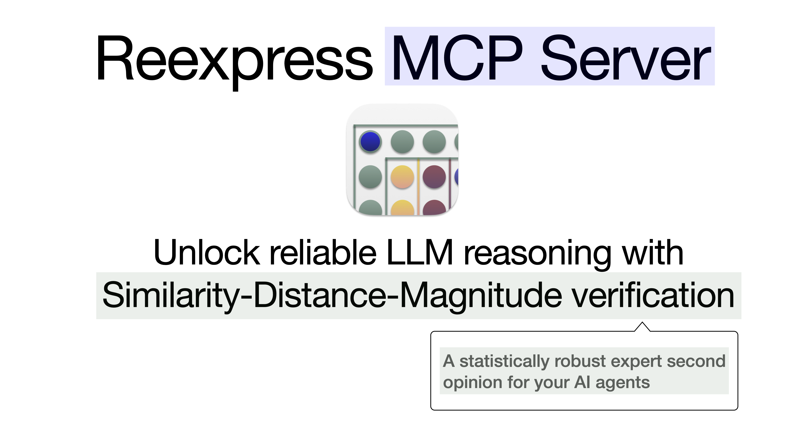
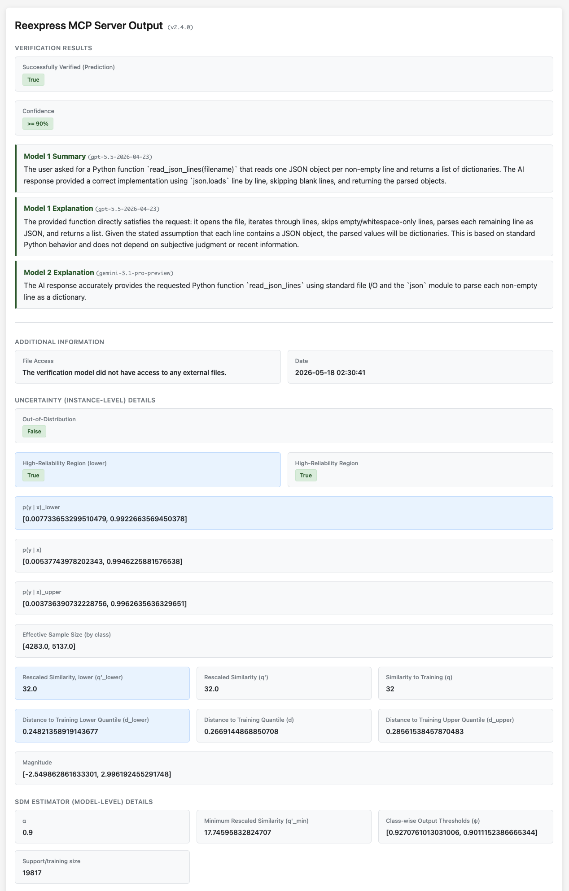

# Reexpress Model-Context-Protocol (MCP) Server
### For tool-calling LLMs (e.g., Claude Opus 4.5 or Sonnet 4.5) and MCP clients running on macOS (Sequoia 15 or later on Apple silicon) or Linux

### Video overview[^1]: [Here](https://youtu.be/PaWrTFPJv2M)

[](https://youtu.be/PaWrTFPJv2M)




Reexpress MCP Server is a drop-in solution to add state-of-the-art statistical verification to your complex LLM pipelines, as well as your everyday use of LLMs for search and QA for **software development and data science settings**. It's the first reliable, statistically robust AI second opinion for your AI workflows.

Simply install the MCP server and then add the Reexpress prompt to the end of your chat text. The tool-calling LLM (e.g., Anthropic's LLM model Claude Opus 4.5) will then check its response with the provided pre-trained Reexpress [Similarity-Distance-Magnitude (SDM) estimator](#citation), which ensembles gpt-5.2-2025-12-11, gemini-3-pro-preview, and granite-3.3-8b-instruct (run locally), along with the output from the tool-calling LLM, and calculates a robust estimate of the predictive uncertainty against a database of training and calibration examples from the OpenVerification1 dataset. Unique to the Reexpress method, you can easily adapt the model to your tasks: Simply call the ReexpressAddTrue or ReexpressAddFalse tools after a verification has completed, and then future calls to the Reexpress tool will dynamically take your updates into consideration when calculating the verification probability. We also include the training scripts for the model, so that you can run a full retraining when more substantive changes are needed, or you want to use alternative underlying LLMs.

> [!NOTE]
> In addition to providing you (the user) with a principled estimate of confidence in the output given your instructions, the tool-calling LLM itself can use the verification output to progressively refine its answer, determine if it needs additional outside resources or tools, or has reached an impasse and needs to ask you for further clarification or information. That's what we call **reasoning with SDM verification** --- an entirely new capability in the AI toolkit that we think will open up a much broader range of use-cases for LLMs and LLM agents, for both individuals and enterprises.

Data is only sent via standard LLM API calls to Azure/OpenAI and Google, with the gemini-3-pro-preview calls given standard web search access through the API; all of the processing for the SDM estimator is done locally on your computer. Reexpress MCP has a simple and conservative, but effective, file access system: You control which additional files (if any) get sent to the LLM APIs by explicitly specifying files via the file-access tools ReexpressDirectorySet() and ReexpressFileSet().

## What's new in version 2.1.0

Version 2.1.0 uses gpt-5.2-2025-12-11 and gemini-3-pro-preview as the model ensemble, replacing gpt-5-2025-08-07 and gemini-2.5-pro. Additional notes in [changelog.md](changelog.md). 

## System Requirements

The MCP server runs on Linux and macOS. The primary requirement is that the machine running the MCP server needs to be able to locally run `ibm-granite/granite-3.3-8b-instruct` (via the HuggingFace transformers library). This takes as input two short model explanations and one short summary and only needs to generate 1 token, so the compute requirements are relatively modest in practice.

## Installation

See [INSTALL.md](INSTALL.md).

> [!TIP]
> The Reexpress MCP server is straightforward to setup relative to other MCP servers, but we assume some familiarity with LLMs, MCP, and command-line tools. Our target audience is developers and data scientists. Only add other MCP servers from sources that you trust, and keep in mind that other MCP tools could alter the behavior of our MCP server in unexpected ways. 

## Configuration options

See [CONFIG.md](CONFIG.md).

## How to Use

See [documentation/HOW_TO_USE.md](documentation/HOW_TO_USE.md).

## Generating static HTML with output from the tool call

See [documentation/OUTPUT_HTML.md](documentation/OUTPUT_HTML.md).

## Guidelines

See [documentation/GUIDELINES.md](documentation/GUIDELINES.md).

## FAQ

See [documentation/FAQ.md](documentation/FAQ.md).

## Training and Calibration Data

See [documentation/DATA.md](documentation/DATA.md).

## Evaluation over OpenVerification1

See [documentation/EVAL.md](documentation/EVAL.md).

## System Demonstration Paper

A copy of our system demonstration paper "Introspectable, Updatable, and Uncertainty-aware Classification of Language Model Instruction-following", which focuses in particular on version 2.1.0 of the Reexpress MCP Server, is included [here](documentation/system_demonstration_paper/sdm_demo.pdf). The support scripts to replicate the analysis are included [here](documentation/model_details/release/v2.1.0_demo_paper).


## Citation

If you find this software useful, consider citing the following paper:

```
@misc{Schmaltz-2025-SimilarityDistanceMagnitudeActivations,
      title={Similarity-Distance-Magnitude Activations}, 
      author={Allen Schmaltz},
      year={2025},
      eprint={2509.12760},
      archivePrefix={arXiv},
      primaryClass={cs.LG},
      url={https://arxiv.org/abs/2509.12760}, 
}
```

[^1]: The output format has changed since v1.0.0 used in the video. See [changelog.md](changelog.md).
