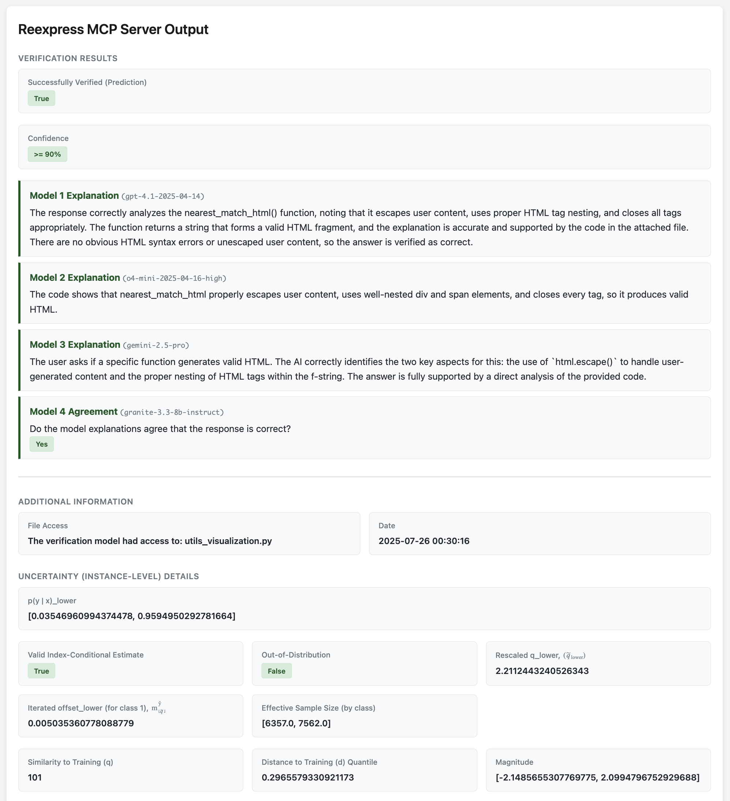

# Reexpress Model-Context-Protocol (MCP) Server
### For tool-calling LLMs (e.g., Claude Opus 4.1 or Sonnet 4) and MCP clients running on Linux or macOS (Sequoia 15 on Apple silicon) 

### Video overview[^1]: [Here](https://youtu.be/PaWrTFPJv2M)

[](https://youtu.be/PaWrTFPJv2M)



Reexpress MCP Server is a drop-in solution to add state-of-the-art statistical verification to your complex LLM pipelines, as well as your everyday use of LLMs for search and QA for **software development and data science settings**. It's the first reliable, statistically robust AI second opinion for your AI workflows.

Simply install the MCP server and then add the Reexpress prompt to the end of your chat text. The tool-calling LLM (e.g., Anthropic's LLM model Claude Opus 4.1) will then check its response with the provided pre-trained Reexpress [Similarity-Distance-Magnitude (SDM) estimator](#citation), which ensembles gpt-5-2025-08-07, gemini-2.5-pro, and granite-3.3-8b-instruct (run locally), along with the output from the tool-calling LLM, and calculates a robust estimate of the predictive uncertainty against a database of training and calibration examples from the OpenVerification1 dataset. Unique to the Reexpress method, you can easily adapt the model to your tasks: Simply call the ReexpressAddTrue or ReexpressAddFalse tools after a verification has completed, and then future calls to the Reexpress tool will dynamically take your updates into consideration when calculating the verification probability. We also include the training scripts for the model, so that you can run a full retraining when more substantive changes are needed, or you want to use alternative underlying LLMs.

> [!NOTE]
> In addition to providing you (the user) with a principled estimate of confidence in the output given your instructions, the tool-calling LLM itself can use the verification output to progressively refine its answer, determine if it needs additional outside resources or tools, or has reached an impasse and needs to ask you for further clarification or information. That's what we call **reasoning with SDM verification** --- an entirely new capability in the AI toolkit that we think will open up a much broader range of use-cases for LLMs and LLM agents, for both individuals and enterprises.

Data is only sent via standard LLM API calls to Azure/OpenAI and Google; all of the processing for the SDM estimator is done locally on your computer. (Optionally, we recommend providing access to web search via your MCP client, such as via Claude Desktop or a web-search MCP server, or for closed-domain settings, access to domain-specific retrieval.) Reexpress MCP has a simple and conservative, but effective, file access system: You control which additional files (if any) get sent to the LLM APIs by explicitly specifying files via the file-access tools ReexpressDirectorySet() and ReexpressFileSet().

## What's new in version 1.2.0

Version 1.2.0 replaces the calls to gpt-4.1-2025-04-14 and o4-mini-2025-04-16-high with a single call to gpt-5-2025-08-07. Consistent with the behavior of an SDM estimator, the earlier versions using the weaker models as inputs were also well-calibrated, but the addition of GPT-5 leads to a noticeable increase in the proportion of non-rejected documents over the held-out test sets. We have additionally updated the [OpenVerification1](https://huggingface.co/datasets/ReexpressAI/OpenVerification1) dataset with the new examples.

## What's new in version 1.1.0

Version 1.1.0 adds a number of new capabilities:

- We added gemini-2.5-pro as part of the model ensemble.
- We increased the o4-mini-2025-04-16 reasoning budget from medium to high.
- We replaced the API calls to the text-embedding-3-large embeddings model with the locally run `ibm-granite/granite-3.3-8b-instruct` model, which we use to construct the representation space over the model explanations from gpt-4.1-2025-04-14, o4-mini-2025-04-16-high, and gemini-2.5-pro.
- We added the ability to *introspect* the predictions against the training set. You can now view the nearest match to each test instance via a static webpage that you can (optionally) generate for each prediction. This also makes it easy to quickly check how the verification estimation was determined without having to call the ReexpressView tool. See [documentation/OUTPUT_HTML.md](documentation/OUTPUT_HTML.md) for examples.
- We include the training script for the model and the model evaluation outputs over the OpenVerification1 dataset in the model directory (see the Release archive). A summary of the evaluation is available at [documentation/EVAL.md](documentation/EVAL.md).
- The training and calibration data are a subset of the full [OpenVerification1](https://huggingface.co/datasets/ReexpressAI/OpenVerification1) dataset, which we have made available on HuggingFace datasets.
- We have updated the output to the MCP server to have all content returned within XML tags to simplify use out-of-the-box for downstream, test-time search graphs. We have also updated our recommended base tool-call prompt with the following final sentence: `Consider your final answer verified if <successfully_verified> True </successfully_verified> and <confidence> >= 90% </confidence>.` 
- We have simplified the presentation of the verification confidence (i.e., the probability estimated for the binary classification prediction) in the main output to the following three bins to reflect the resolution at which we recommend using the tool:
    - `>= 90%`
    - `< 90% (use with caution)`
    - `Out-of-distribution (unreliable)`

- Note that we have reduced the probability threshold to 0.9 (i.e., alpha'=0.9, down from the more stringent 0.95 in version 1.0.0) to better reflect the capabilities of the current generation of models and the intended use-case of verification with a human-in-the-loop. This version admits approximately 62% of in-distribution examples at alpha'=0.9 (i.e., the proportion of valid index-conditional estimates at alpha'=0.9) from the 5k test set of the OpenVerification1 dataset, over which the marginal accuracy is approximately 92%. If you need a version with a more stringent requirement (and/or recalibration over your domain specific tasks), we provide the training code here, as noted above. For mission-critical enterprise settings and semi-autonomous agents that require `alpha' > 0.9`, we typically recommend training a full SDM network that composes the hidden states over all input text (prompt, response, and if applicable, the composition of the output of additional LLMs). (In contrast, the current MCP server uses an SDM estimator that marginalizes over the content of the prompt and response, and takes as input an ensemble of explanations from external LLMs. This is done to keep computational costs manageable for local deployment with existing LLM APIs.) We can assist you with building such SDM networks. Contact us!
- We modified the baseline configuration in [code/reexpress/mcp_settings.json](code/reexpress/mcp_settings.json).
- Finally, we added a new tool function, reexpress_add_ood(), which allows you to add an out-of-distribution (label=-99) instance to the support set. (For developers and researchers, we have also updated the training and calibration routines to allow such instances to participate in training and calibration. Instances in the --ood_support_file get added to the training support for each training iteration, and thus can impact the Similarity values of training and calibration instances, if applicable.)
- For researchers: Starting in commit c816516 is a script (`utils_graph_output.py`) to construct interactive graphs of the batch output. See the end of the [training script](documentation/model_details/release/v1.1.0/train_and_eval_sdm_estimator_v1.1.0.sh) for example use. You can click on a point to print additional information to the console. [Graphs for the output](documentation/model_details/release/v1.1.0/output_graphs)  of the SDM estimator in this release are saved to the repo for reference.

## System Requirements

The MCP server runs on Linux and macOS. The primary requirement is that the machine running the MCP server needs to be able to locally run `ibm-granite/granite-3.3-8b-instruct` (via the HuggingFace transformers library). This takes as input two short model explanations and one short summary and only needs to generate 1 token, so the compute requirements are relatively modest in practice.

## Installation

See [INSTALL.md](INSTALL.md).

> [!TIP]
> The Reexpress MCP server is straightforward to setup relative to other MCP servers, but we assume some familiarity with LLMs, MCP, and command-line tools. Our target audience is developers and data scientists. Only add other MCP servers from sources that you trust, and keep in mind that other MCP tools could alter the behavior of our MCP server in unexpected ways. 

## Configuration options

See [CONFIG.md](CONFIG.md).

## How to Use

See [documentation/HOW_TO_USE.md](documentation/HOW_TO_USE.md).

## Generating static HTML with output from the tool call

See [documentation/OUTPUT_HTML.md](documentation/OUTPUT_HTML.md).

## Guidelines

See [documentation/GUIDELINES.md](documentation/GUIDELINES.md).

## FAQ

See [documentation/FAQ.md](documentation/FAQ.md).

## Training and Calibration Data

See [documentation/DATA.md](documentation/DATA.md).

## Evaluation over OpenVerification1

See [documentation/EVAL.md](documentation/EVAL.md).

## Citation

If you find this software useful, consider citing the following paper:

```
@misc{Schmaltz-2025-SimilarityDistanceMagnitudeUniversalVerification,
      title={Similarity-Distance-Magnitude Universal Verification}, 
      author={Allen Schmaltz},
      year={2025},
      eprint={2502.20167},
      archivePrefix={arXiv},
      primaryClass={cs.LG},
      url={https://arxiv.org/abs/2502.20167}, 
}
```

[^1]: The output format has changed slightly since v1.0.0 used in the video. See [What's new in version 1.2.0](#whats-new-in-version-120)
